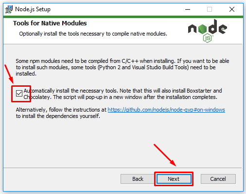

# ITSC VEaaS (Virtual Event as a Service)

## Application Purpose and Context

Due to COVID-19, a lot of organizations have been forced to cancel their in-person events and conferences. We have developed a platform to allow these organizations to take their events virtual, with embedded videos, live streams, and discussion boards.

Your goal will be to create a mini virtual IT expo to showcase your fellow interns’ projects. This site will include embedded videos, information about each “presenter”, and live stream main stage, and a live chat section for each “presenter”

## ITSC Guidelines

* Setup
  * PLEASE ask if you're having trouble setting up your project repository, project board, first branch, or development environment.  The mentors are here to help you!  We want to make sure you get off to a great start and this part is often the most challenging, so please don't hesitate to come to us immediately with any setup concerns!
* Hour/Day Policy
  * If you've been stuck on something for two hours, ask a fellow intern!
  * If you've been stuck on something for a full day, ask a mentor!
* Process for Getting Unstuck
    1. Search through the available resources in this document (located at the bottom of the page and throughout)
    2. Google!  This is your most valuable resource and learning how to search the internet for your answer is going to be your most valuable skill moving forward!  Forum resources like StackOverflow can be extremely helpful.  In web development, there's almost always someone who has encountered your problem before.  The trick lies in finding that answer!
    3. Ask an internship peer
    4. Ask an mentor

## Technologies Used

* NodeJS
* NPM
* Google Analytics
* Front-End Libraries
  * React
  * React-Static
  * Disqus
* Back-End Libraries
  * Netlify

## System Architecture

This is a static website and only relies on the built front-end code and the Netlify CDN that delivers the static assets.

## Use Cases and Examples

* [2020 IT EXPO](https://itexpo20.live)
* [Political Science Nexus 2020](https://poliscinexus20.live)
* [UC International Online Conference](https://ucintlconference.live)

## Universal Concepts

* JavaScript best practices (some are enforced by eslint)
* Use of source control (git and github)
  * Whenever you start a new task, you should make a branch from master, commit and push your code to the new branch often, and then merge to master when you are done

## Tasks

Through all of these tasks, ensure the site you are building is accessible to persons with disabilities ([UC Accessibility Policy](https://www.uc.edu/about/accessibility-network/getting-started/policy.html))

### Setup

1. Clone the Template Repository
    * You can name this whatever you want, just make certain that you leave it "Public" so that others can view your code
    * Resources:
        * [Creating a Repository from a Template](https://docs.github.com/en/github/creating-cloning-and-archiving-repositories/creating-a-repository-from-a-template)
2. Copy the [Template Project Board](https://github.com/UC-ITSC/Virtual-Event-Template/projects/1)
    * This is something you should keep constantly up-to-date. It is how we will track your progress.
        * Resources:
            * [Copying a Project Board](https://docs.github.com/en/github/managing-your-work-on-github/copying-a-project-board)
3. Add the [Provided Issues](docs/issues.md) to your Project Board
    * Resources:
        * [Creating an Issue](https://docs.github.com/en/github/managing-your-work-on-github/creating-an-issue)
        * [Adding Issues to a Project Board](https://docs.github.com/en/github/managing-your-work-on-github/adding-issues-and-pull-requests-to-a-project-board#adding-issues-and-pull-requests-to-a-project-board-from-the-sidebar)
4. Install NodeJS 12.x on your computer (Do NOT install Node 14 or the project will not run)
      * [MacOS Installer for 12.21.0](https://nodejs.org/download/release/latest-v12.x/node-v12.21.0.pkg)
      * Windows  When installing windows, please make sure to check the "Automatically install the necessary tools" box at the end 
         
        * [Windows x64 Installer for 12.21.0](https://nodejs.org/download/release/latest-v12.x/node-v12.21.0-x64.msi)
        * [Windows x86 Installer for 12.21.0](https://nodejs.org/download/release/latest-v12.x/node-v12.21.0-x86.msi)
      * [Latest 12.x for all platforms](https://nodejs.org/download/release/latest-v12.x/)
5. Install [Git](https://git-scm.com/downloads) on your computer
6. Install [VS Code](https://code.visualstudio.com/) your computer
7. Clone the project from GitHub
      * See the resources belong on using Git
8. Install the project
      * In VS Code, open a terminal window from the top (if one is not already open)
      * Run the command `npm install`
9. Start the project
      * In VS Code, open a terminal window from the top (if one is not already open)
      * Run the command `npm start`

### Milestone 1

1. Create the event home page including:
   * An embedded YouTube live stream
   * A schedule of events
2. Create a page for each project type (DevOps, OCAT, VEaaS, etc) to list the projects for each one
3. Create a template page to display each project
   * Page should include a video embed, some text data about the project, and the name of the person who made the project
   * This should be a template page that receives JSON data to populate the specific project information, but you might have a different template page for each project type
4. Publish the site to Netlify
   * [Make a Netlify account](https://app.netlify.com/signup?_ga=2.152698749.579539556.1598646102-1291164933.1598024532)
   * [Log in to Netlify from your command line](https://docs.netlify.com/cli/get-started/#authentication)
   * Run the command `npm run deploy:prod` to deploy

### Milestone 2 (Stretch tasks if time allows)

1. Integrate a live chat for each project page
   * Recommend using [Disqus](https://disqus.com/)
   * There is a React wrapper for Disqus that makes it very easy to implement called [Disqus-React](https://www.npmjs.com/package/disqus-react)
2. Add a countdown timer to the home page and prevent users from accessing the project pages until the countdown is complete
3. Change the embedded video/stream on the home page to show a static video before the countdown and the live stream after the countdown

## Resources

* React
  * [Intro to React](https://reactjs.org/tutorial/tutorial.html)
  * [Main Concepts](https://reactjs.org/docs/hello-world.html)
  * Video: [React Tutorial for Beginners](https://www.youtube.com/watch?v=dGcsHMXbSOA)
* React-Static
  * [React-Static getting started guide](https://github.com/react-static/react-static/tree/master/docs)
  * [React-Static Architecture Discussion](https://medium.com/@tannerlinsley/%EF%B8%8F-introducing-react-static-a-progressive-static-site-framework-for-react-3470d2a51ebc)
  * Video: [Introduction to React-Static](https://www.youtube.com/watch?v=OqbJ5swVpDQ)
* Git
  * [Using git with VS Code](https://code.visualstudio.com/docs/editor/versioncontrol#_git-support)
  * [Using git with Github Desktop](https://docs.github.com/en/desktop/installing-and-configuring-github-desktop/getting-started-with-github-desktop)
* Recommended VS Code Extensions
  * [Bracket Pair Colorizer 2](https://marketplace.visualstudio.com/items?itemName=CoenraadS.bracket-pair-colorizer-2)
  * [Code Spell Checker](https://marketplace.visualstudio.com/items?itemName=streetsidesoftware.code-spell-checker)
  * [ESLint](https://marketplace.visualstudio.com/items?itemName=dbaeumer.vscode-eslint)
  * [Path Intellisense](https://marketplace.visualstudio.com/items?itemName=christian-kohler.path-intellisense)
